# DCCExpress - Railway Model Control System

⚠️ **Early Alpha Version - Under Development** ⚠️

DCCExpress is a **web-based railway model layout editor and control system**. It allows users to **design and manage railway tracks** interactively, including placing **turnouts, signals, and occupancy sensors** on a digital layout.

### 📖 Read the [Wiki](https://github.com/jungervin/DCCExpress/wiki) pages or [CHANGELOG](https://github.com/jungervin/DCCExpress/blob/main/CHANGELOG.md) for more details.

## 🚂 Features (Planned & Current)
- ✅ **Web-based editor** for designing railway tracks
- ✅ **Interactive placement** of turnouts, signals, and sensors
- ✅ **Real-time track control** through a digital command center
- ✅ **Automation scripting support** via dispatcher.js
- ✅ **Audio support:** button presses or via dispatcher.js automation.
- ✅ **[Roco Z21](https://github.com/jungervin/DCCExpress/wiki/Command-Centers)**    
 - ✅ **[DCC-Ex 5.4.0 TCP](https://github.com/jungervin/DCCExpress/wiki/Command-Centers)**
- ✅ **[DCC-Ex 5.4.0 Serial Port](https://github.com/jungervin/DCCExpress/wiki/Command-Centers)**
- ⏳ **Node-RED integration**

# 🚂🛂🚦Automation & Scripting
The dispatcher.js & scheduler.js files allows users to write control automation scripts for managing railway operations. This enables advanced behaviors like automated signal switching, turnout control, and event-based operations.

(You need to edit the `DCCExpress/dist/dispatcher.js` | `DCCExpress/dist/scheduler.js` file. 
In the menu, reload the script by clicking on the **Dispatcher** | **Scheduler** icon.)

## 🚀Quick Start Guide


⚠️The NodeJS environment must be installed! ⚠️  
⚠️ It can be downloaded from here: [https://nodejs.org/en/download](https://nodejs.org/en/download). ⚠️

1. **Download the ZIP file.**  
~~2. **Extract it** and navigate to the dist folder.~~  
~~3. **Run the server** by launching DCCExpress.exe.~~
2. **Extract it** and navigate to the `extracted` folder.  
3. **Run the server** by launching `start.bat`.  
4. **Open your browser** and go to `127.0.0.1:3000`. 🚀
5. **Configure the command center settings**

### 📺 https://www.youtube.com/watch?v=YhDMJcTy7pI

## 💻 Installation & 🚂Setup & 🚀Run 

_(Installation instructions will be added as the project progresses.)_

For now, you can **clone the repository** and install dependencies:

```sh
git clone https://github.com/jungervin/DCCExpress.git
cd DCCExpress
npm install
cd dist
:~/DCCExpress/dist$ node server/js/server/src/index.js
```
## 🛠️Compile/Build
```sh
cd DCCExpress/client
tsc --build
```
```sh
cd DCCExpress/server
tsc --build
```
#### To create an executable file, use the following command inside the `dist` folder:  

```sh
:~/DCCExpress/dist$ pkg . --targets node18-win
```

## 📅 Development Status
DCCExpress is in early alpha and actively evolving.
🚧 Expect frequent changes, breaking updates, and experimental features.

## 📌 Roadmap
 DCC-EX compatibility
 Advanced track planning tools
 Multi-user collaboration
 Improved UI and interaction

## 🤝 Contributing
Contributions, feedback, and testing are welcome! If you're interested in helping, please check out the issues section.

## 📜 License
GPL-3.0 license


## 📸 Screenshots
Last 2025-03-06
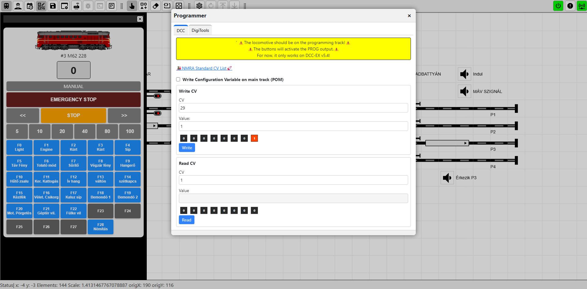

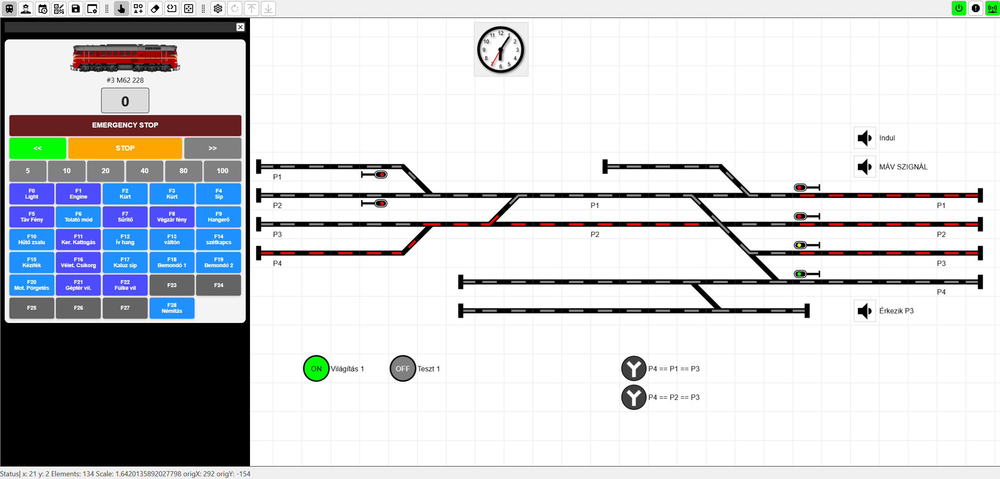
Other images
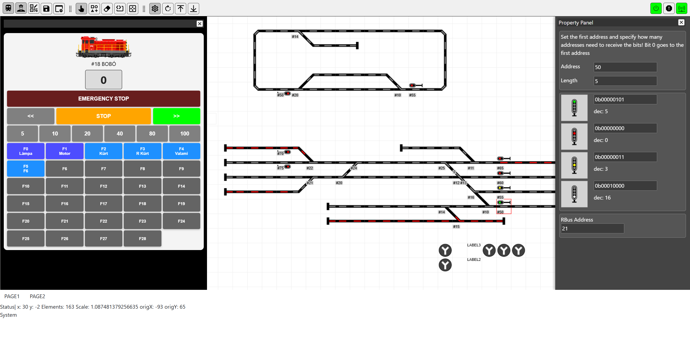

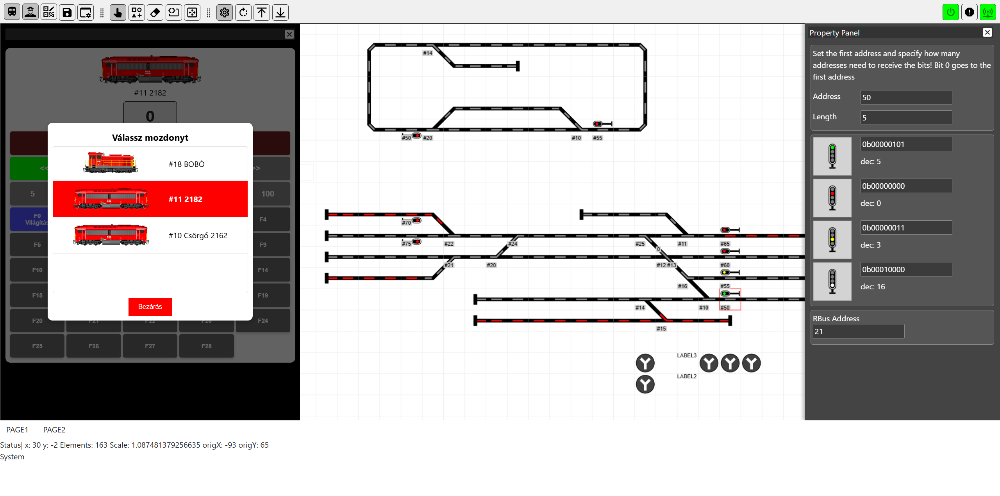

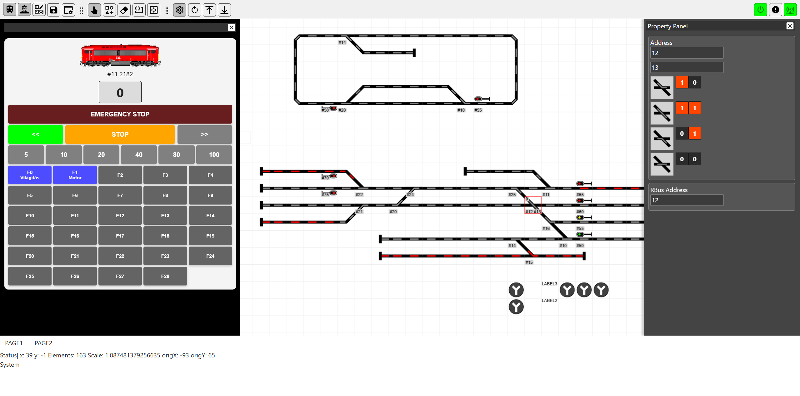

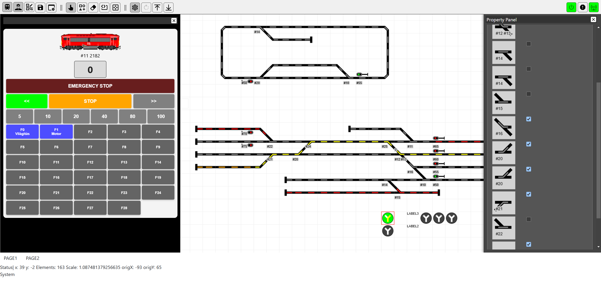

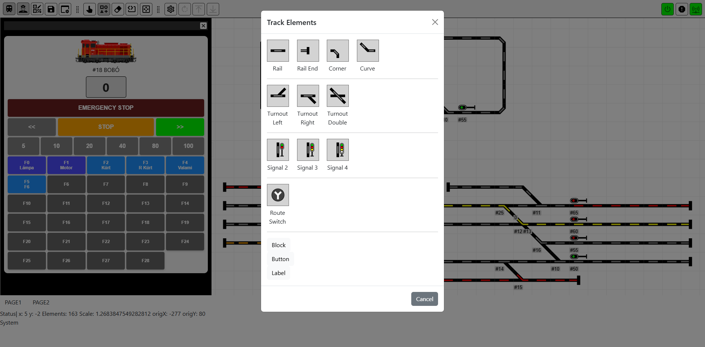

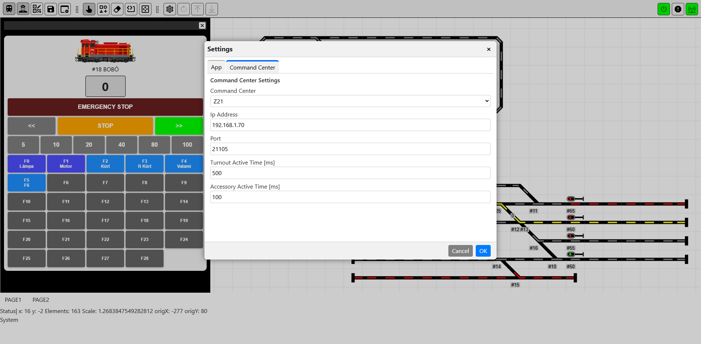

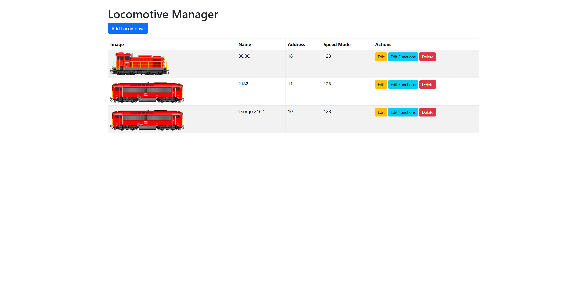

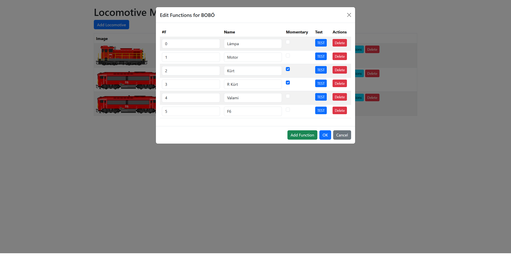

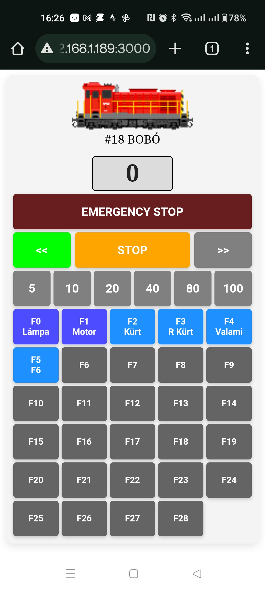