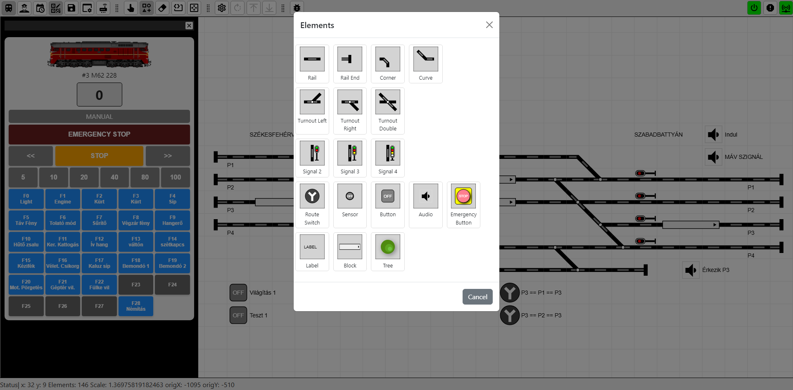

# DCCExpress - Railway Model Control System

⚠️ **Early Alpha Version - Under Development** ⚠️

DCCExpress is a **web-based railway model layout editor and control system**. It allows users to **design and manage railway tracks** interactively, including placing **turnouts, signals, and occupancy sensors** on a digital layout.

## 🚂 Features (Planned & Current)
- ✅ **Web-based editor** for designing railway tracks
- ✅ **Interactive placement** of turnouts, signals, and sensors
- ✅ **Real-time track control** through a digital command center
- ✅ **Automation scripting support** via dispatcher.js
- ✅ **Current support:** 🟢 **Roco Z21 Command Center**       
- ⏳ **Upcoming support:** 🔜 **DCC-EX integration**

# 🚂🛂🚦Automation & Scripting
The dispatcher.js file allows users to write control automation scripts for managing railway operations. This enables advanced behaviors like automated signal switching, turnout control, and event-based operations.

(You need to edit the `DCCExpress/dist/dispatcher.js` file. 
In the menu, reload the script by clicking on the **Dispatcher** icon.)

## 🚀Quick Start Guide

1. **Download the ZIP file.**  
2. **Extract it** and navigate to the `dist` folder.  
3. **Configure the command center settings** in the `settings.json` file (IP, port).  
4. **Run the server** by launching `DCCExpress.exe`.  
5. **Open your browser** and go to `127.0.0.1:3000`. 🚀

## 💻 Installation & 🚀Setup & 🚂Run 

_(Installation instructions will be added as the project progresses.)_

For now, you can **clone the repository** and install dependencies:

```sh
git clone https://github.com/jungervin/DCCExpress.git
cd DCCExpress
npm install
cd dist
:~/DCCExpress/dist$ node server/js/server/src/index.js
```
## 🛠️Compile/Build
```sh
cd DCCExpress/client
tsc --build
```
```sh
cd DCCExpress/server
tsc --build
```
#### To create an executable file, use the following command inside the `dist` folder:  

```sh
pkg . --targets node18-win
```

## 📅 Development Status
DCCExpress is in early alpha and actively evolving.
🚧 Expect frequent changes, breaking updates, and experimental features.

## 📌 Roadmap
 DCC-EX compatibility
 Advanced track planning tools
 Multi-user collaboration
 Improved UI and interaction

## 🤝 Contributing
Contributions, feedback, and testing are welcome! If you're interested in helping, please check out the issues section.

## 📜 License
GPL-3.0 license


## 📸 Screenshots





